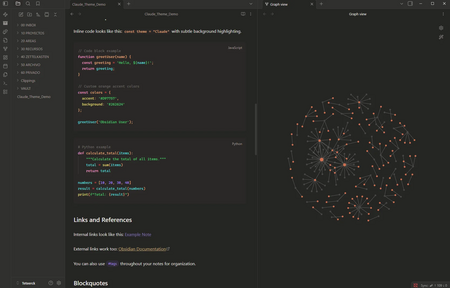
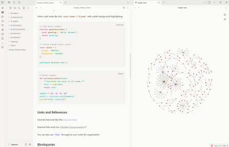

# Claude Theme for Obsidian

A warm, clean, and professional theme inspired by Claude's interface. Designed for comfortable reading and focused writing.



## ✨ Features

- 🧡 **Warm Color Palette** - Soothing neutral tones with distinctive orange accents
- 🌙 **Full Dark & Light Mode** - Complete support for both color schemes
- 📖 **Comfortable Reading** - Generous line spacing (1.7) and optimized typography
- ✨ **Smooth Interactions** - Polished hover effects and transitions
- 💻 **Clean Code Blocks** - Well-styled code with monospace fonts
- 🎨 **Professional UI** - Carefully designed sidebar, tabs, and navigation
- ✅ **Custom Checkboxes** - Beautiful task list styling
- 📊 **Enhanced Tables** - Hover effects and clean borders

## 🎨 Color Palette

### Dark Mode
- **Background**: `#262624` - Warm dark gray
- **Sidebar**: `#30302E` - Slightly lighter gray
- **Accent**: `#D97757` - Warm orange
- **Text**: `#E8E6E3` - Soft white

### Light Mode
- **Background**: `#FAFAF8` - Warm off-white
- **Sidebar**: `#F4F3F1` - Light gray
- **Accent**: `#CC6B3C` - Deep orange
- **Text**: `#2C2B29` - Warm black

## 📥 Installation

### From Obsidian Community Themes (Recommended)
1. Open **Settings** in Obsidian
2. Navigate to **Appearance** → **Themes**
3. Click **Manage**
4. Search for **"Claude Theme"**
5. Click **Install and use**

### Manual Installation
1. Download `theme.css` and `manifest.json` from this repository
2. Create a folder called `Claude` in your vault's `.obsidian/themes/` directory
3. Place both files in the `Claude` folder
4. In Obsidian, go to **Settings** → **Appearance** → **Themes**
5. Select **Claude Theme** from the dropdown

## 📸 Screenshots

### Dark Mode


### Light Mode


## 🎯 Design Philosophy

This theme is inspired by Claude's clean and professional interface. The goal was to create a workspace that feels:

- **Warm and inviting** - Not sterile or cold
- **Professional** - Suitable for serious work
- **Readable** - Optimized for long reading sessions
- **Unobtrusive** - The content is the focus, not the theme

## 🛠️ Customization

You can customize the theme by editing the CSS variables at the top of `theme.css`:

```css
body.theme-dark {
  --background-primary: #262624;
  --interactive-accent: #D97757;
  /* ... more variables */
}
```

## 🐛 Known Issues

None currently! If you find any bugs, please [open an issue](../../issues).

## 🤝 Contributing

Contributions are welcome! Feel free to:
- Report bugs
- Suggest features
- Submit pull requests
- Share your customizations

## 📝 Changelog

### Version 1.0.0 (2025-01-09)
- Initial release
- Full dark and light mode support
- Custom styling for all Obsidian elements

## 📜 License

MIT License - feel free to modify and share!

## 💖 Credits

Created by Ricardo

Inspired by Claude's interface (Anthropic)

## 🔗 Links

- [Report an Issue](../../issues)
- [Obsidian Community](https://obsidian.md/community)

---

**Enjoy the theme? Give it a ⭐ on GitHub!**
